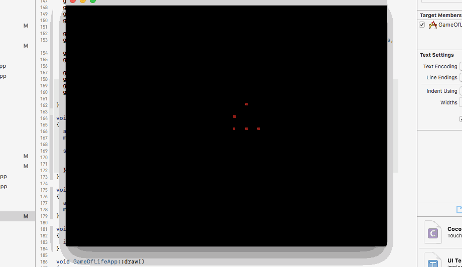

This is an implementation of Conways Game Of Life in 3D.
This was an early OpenGL experiment, there are many features that could be added and the lighting could...well, it could be fixed.  It's also the first time I've implemented the Entity-Component-System pattern in a way that I'm happy with.  All in all, it was a good learning experience.

